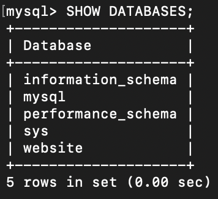
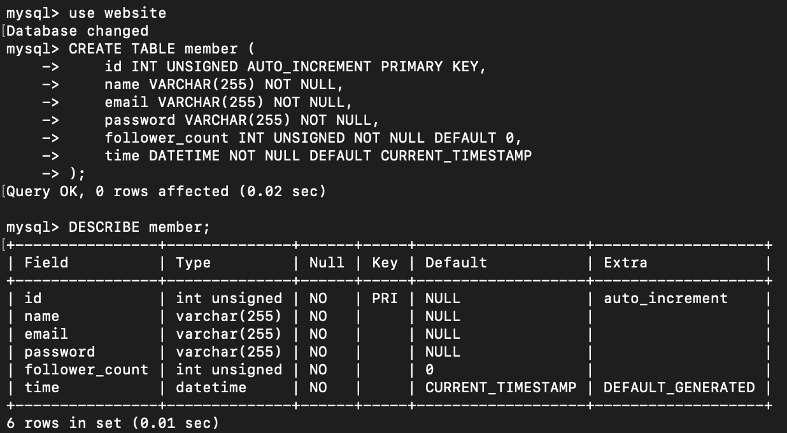
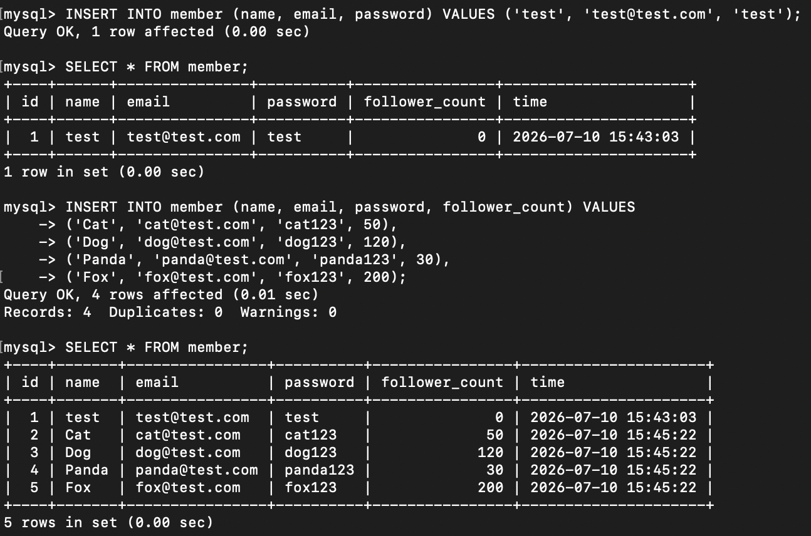
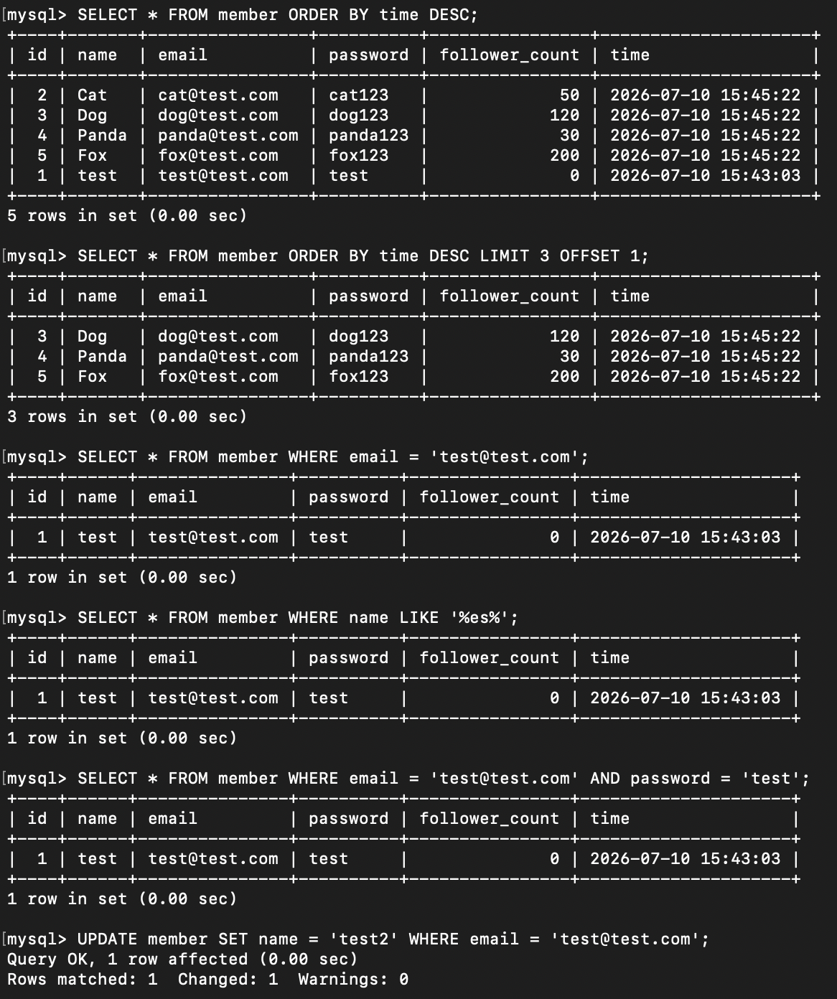
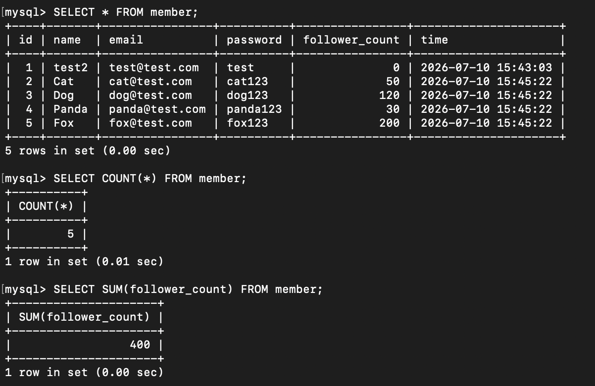
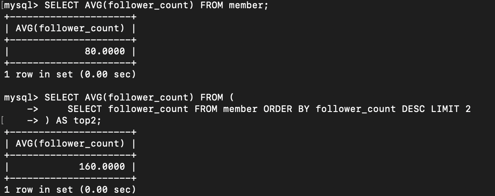
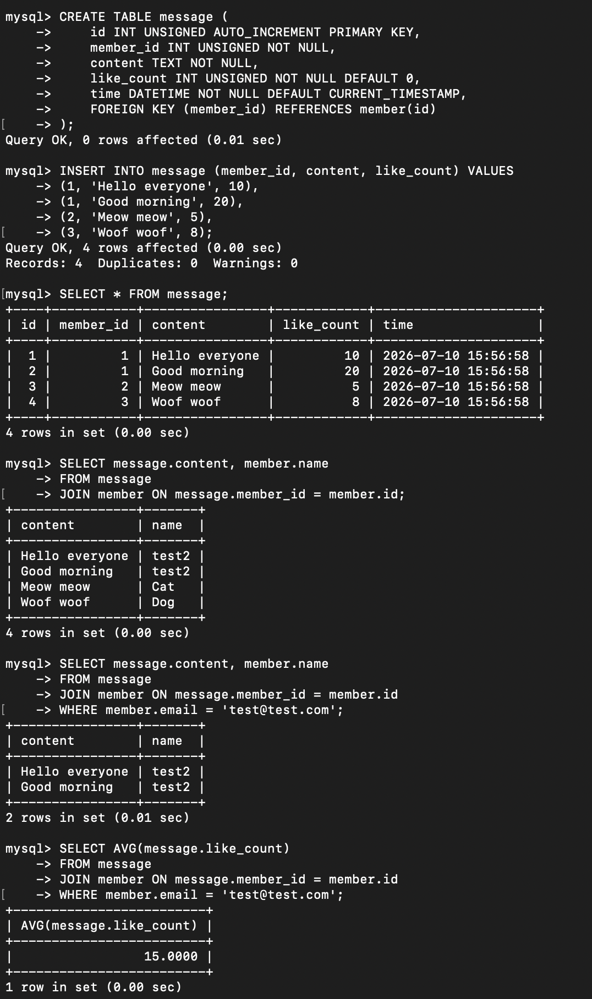
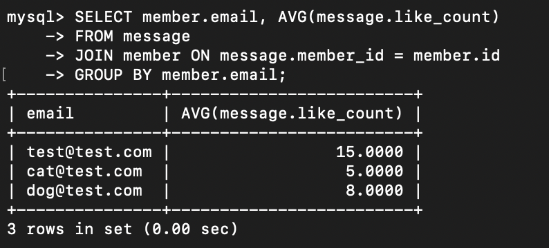

# WeHelp 第五週作業 — MySQL 資料庫操作

這週第一次接觸資料庫，學著用終端機操作 MySQL，從安裝、建資料庫、建表，到各種 SQL 查詢跟 JOIN。過程中卡了不少關，不過最後都一題一題做完了（也感謝我的工程師朋友支援...）。

資料庫匯出檔放在這裡：[data.sql](./data.sql)

環境：macOS（Apple 晶片）+ MySQL 8.4.10

---

## Task 2：建立資料庫與資料表

### 建立 website 資料庫

一開始就先建好資料庫。因為我中途離開又重連了好幾次終端機，最早那次 `CREATE DATABASE website;` 的畫面沒留著，所以這裡改用 `SHOW DATABASES;` 來確認資料庫確實有建起來（可以看到清單最下面的 website）。

建立資料庫用的指令是：

```sql
CREATE DATABASE website;
```

確認結果：

```sql
SHOW DATABASES;
```



### 建立 member 資料表

進到 website 之後建 member 表。這邊花最多時間搞懂每個欄位的型別跟限制，像是 id 要 `AUTO_INCREMENT PRIMARY KEY`、非負整數用 `UNSIGNED`、時間預設當下用 `CURRENT_TIMESTAMP`。建完用 `DESCRIBE` 檢查了一下結構。

```sql
CREATE TABLE member (
    id INT UNSIGNED AUTO_INCREMENT PRIMARY KEY,
    name VARCHAR(255) NOT NULL,
    email VARCHAR(255) NOT NULL,
    password VARCHAR(255) NOT NULL,
    follower_count INT UNSIGNED NOT NULL DEFAULT 0,
    time DATETIME NOT NULL DEFAULT CURRENT_TIMESTAMP
);
```

```sql
DESCRIBE member;
```



---

## Task 3：SQL CRUD

### 新增 test 資料，再新增 4 筆

先照題目要求加一筆 test，再加 4 筆自己隨便取的。這幾筆我有另外填 follower_count，是為了後面 Task 4 算總和跟平均的時候才看得出效果，不然全部都是預設 0 就看不出來了。加完馬上 `SELECT *` 看一下有沒有進去。

```sql
INSERT INTO member (name, email, password) VALUES ('test', 'test@test.com', 'test');
```

```sql
INSERT INTO member (name, email, password, follower_count) VALUES
('Cat', 'cat@test.com', 'cat123', 50),
('Dog', 'dog@test.com', 'dog123', 120),
('Panda', 'panda@test.com', 'panda123', 30),
('Fox', 'fox@test.com', 'fox123', 200);
```

```sql
SELECT * FROM member;
```



### 各種查詢（排序、取範圍、條件、模糊比對、多條件）與 UPDATE

這一段把題目要求的查詢一次做完。比較有印象的是取「第 2 到第 4 筆」那題，原本以為是抓 id 2、3、4，後來才懂是排序後的第 2 到第 4 個位置，要用 `LIMIT 3 OFFSET 1`（跳過第 1 筆，往後拿 3 筆）。最後用 UPDATE 把 test 改成 test2。

依 time 由新到舊排序：

```sql
SELECT * FROM member ORDER BY time DESC;
```

排序後取第 2 到第 4 筆：

```sql
SELECT * FROM member ORDER BY time DESC LIMIT 3 OFFSET 1;
```

查 email 等於 test@test.com：

```sql
SELECT * FROM member WHERE email = 'test@test.com';
```

查 name 包含 es：

```sql
SELECT * FROM member WHERE name LIKE '%es%';
```

查 email 跟 password 都符合：

```sql
SELECT * FROM member WHERE email = 'test@test.com' AND password = 'test';
```

把 test 的 name 改成 test2：

```sql
UPDATE member SET name = 'test2' WHERE email = 'test@test.com';
```



---

## Task 4：SQL 聚合函式

算數量、總和、平均，還有前 2 名的平均。前三個滿直覺的。最後一題「前 2 名的平均」要用子查詢，先把前 2 筆圈出來當成一張小表（`AS top2`），再對它算平均。

數量：

```sql
SELECT COUNT(*) FROM member;
```

總和：

```sql
SELECT SUM(follower_count) FROM member;
```



平均：

```sql
SELECT AVG(follower_count) FROM member;
```

依 follower_count 由大到小取前 2 筆，算它們的平均：

```sql
SELECT AVG(follower_count) FROM (
    SELECT follower_count FROM member ORDER BY follower_count DESC LIMIT 2
) AS top2;
```



---

## Task 5：SQL JOIN

先建 message 表，這裡第一次用到外鍵（`FOREIGN KEY`），讓 member_id 一定要對應到 member 表裡真的存在的 id。建完塞了幾筆留言（故意讓同一個人發兩則，方便後面算平均），然後開始練 JOIN。

JOIN 的觀念我覺得是這週最有收穫的：留言表只存發文者的號碼（member_id），要顯示名字的時候再用 `JOIN ... ON` 把兩張表對起來就好，不用把名字重複存一遍。

建 message 表：

```sql
CREATE TABLE message (
    id INT UNSIGNED AUTO_INCREMENT PRIMARY KEY,
    member_id INT UNSIGNED NOT NULL,
    content TEXT NOT NULL,
    like_count INT UNSIGNED NOT NULL DEFAULT 0,
    time DATETIME NOT NULL DEFAULT CURRENT_TIMESTAMP,
    FOREIGN KEY (member_id) REFERENCES member(id)
);
```

放幾筆留言：

```sql
INSERT INTO message (member_id, content, like_count) VALUES
(1, 'Hello everyone', 10),
(1, 'Good morning', 20),
(2, 'Meow meow', 5),
(3, 'Woof woof', 8);
```

所有留言＋發文者名字：

```sql
SELECT message.content, member.name
FROM message
JOIN member ON message.member_id = member.id;
```

只看 email 是 test@test.com 的人發的留言：

```sql
SELECT message.content, member.name
FROM message
JOIN member ON message.member_id = member.id
WHERE member.email = 'test@test.com';
```

算 test@test.com 這個人的留言平均按讚數：

```sql
SELECT AVG(message.like_count)
FROM message
JOIN member ON message.member_id = member.id
WHERE member.email = 'test@test.com';
```



依發文者 email 分組，算每組的平均按讚數：

```sql
SELECT member.email, AVG(message.like_count)
FROM message
JOIN member ON message.member_id = member.id
GROUP BY member.email;
```


